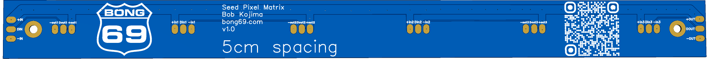

# Seed Pixel Matrix

- PCB size is 25mm x 300mm (0.98" x 11.81")
- Designed to use seed pixels with 5cm spacing
- Each PCB uses 3 loops of LED seed pixels.  For example a loop of 64 seed pixels would be one continuous string of 32 seed pixels down and 32 seed pixels up.
- PCBs can be joined together using the in and out pads on the sides of the board
- The gerber files for the PCB and the STL file for the spacer are included in this project

This PCB is my solution for building a seed pixel matrix on my garage door.  I needed my garage door to still function so I could pull my car in and out easily.  I also wanted to use seed pixels since they are small and save on weight and I wanted nice even spacing of the matrix.  The total size of my matrix is 32 x 84 or 2688 pixels.  I used 14 of the boards on my 16' garage door.  42 loops of 64 seed pixels.  I joined 2 boards together and used 7 ports on my controller (384 pixels per port).

## How do I make them waterproof?
Im not sure if you can make them 100% waterproof.  You could try using a dab of silicon or liquid electrical tape on each solder joint.  Conformal Coating may work too. 

## How do I hang them?
There are 2 mounting holes on the PCB.  My garage door is made of wood, so im using screws to mount them directly to the garage door.  If you dont want to make holes or you are mounting these to metal you could use 3M command strips or maybe expoxy some neodymium magnets to the back of the PCB.

## How can I make them evenly spaced?
I have included an STL file for a 3D printed spacer.  You will need to print 2 spacers for each PCB.  The spacers are joined together using a 5/16-18 bolt (like these: https://www.amazon.com/dp/B00OHU2QVU).  The bolt also provides weight to help pull the strings straight.  The spacer is hooked on near the bottom of the LED loop.

<!-- Generated by https://t.cuts.so/github/video -->

